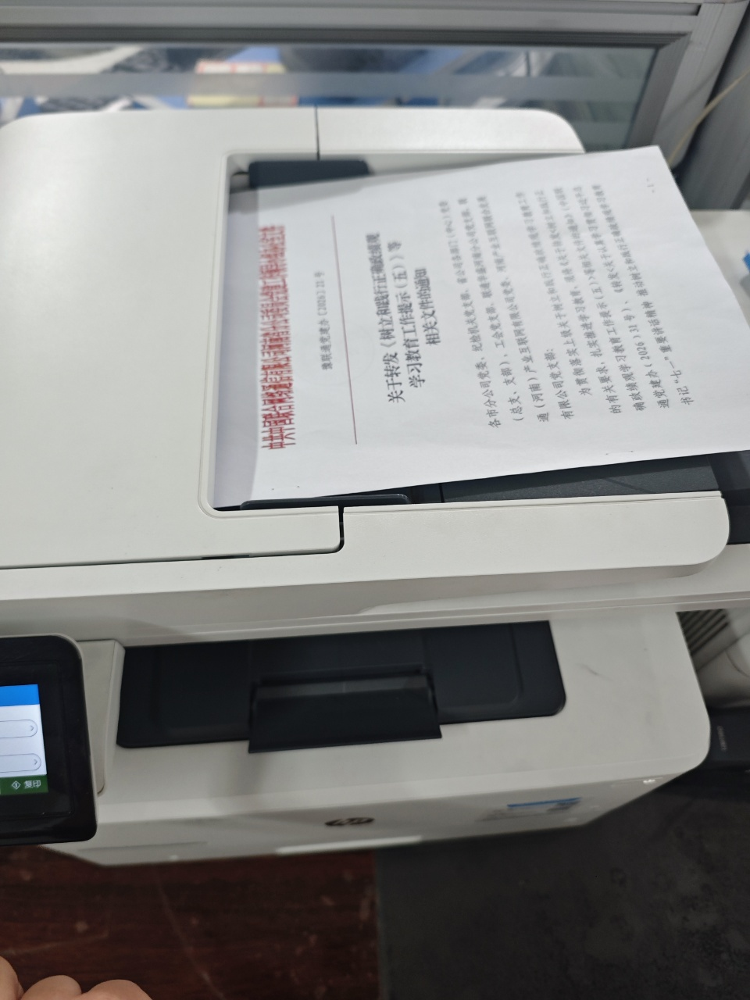

| 序号  | 事项             | 检查点   | 所需资源 | 工具模版                                           |
| --- | -------------- | ----- | ---- | ---------------------------------------------- |
| 1   | 确认纸盒有纸         | □装纸情况 | 打印机  |                                                |
| 2   | 确认原稿逆时针旋转90°放入 | □放入位置 | 原稿   |   |
