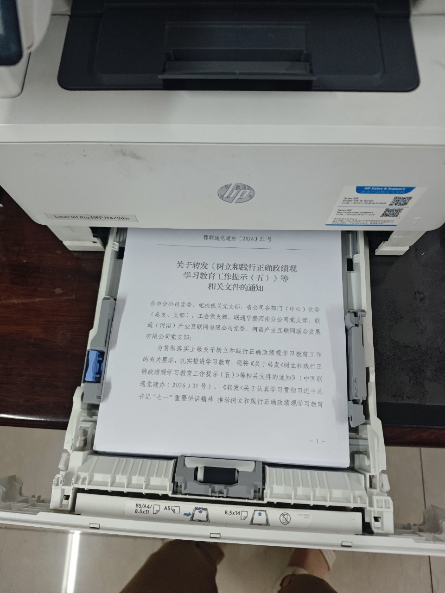

| 序号  | 事项                | 检查点       | 所需资源  | 工具模版                                       |
| --- | ----------------- | --------- | ----- | ------------------------------------------ |
| 1   | 打印后的纸放入纸盒--正常阅读位置 | □放入位置  | 打印后的纸 |  |
| 2   | 开始打印              | □确认机器正常运转 | 打印机   |                                            |
|     |                   |           |       |                                            |
