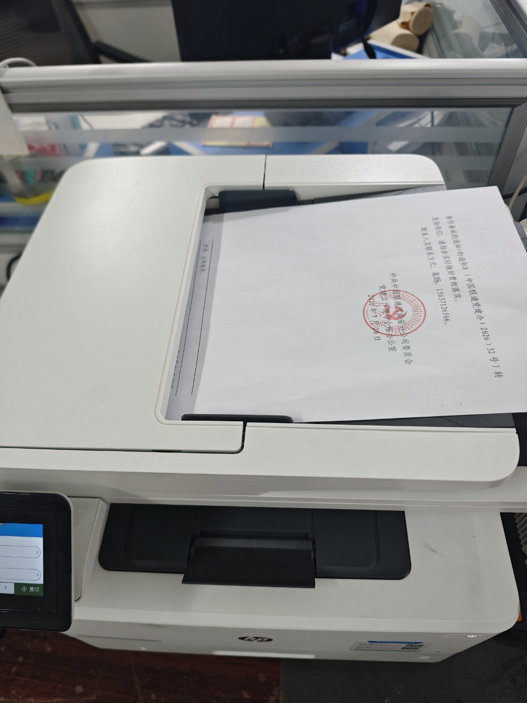

| 序号  | 事项                    | 检查点        | 所需资源 | 工具模版                                       |
| --- | --------------------- | ---------- | ---- | ------------------------------------------ |
| 1   | 排序后原稿放入传送带，顺时针旋转90°放入 | □确认摆放位置    | 原稿   |  |
| 2   | 打印                    | □确认打印机正常工作 | 打印机  |                                            |
